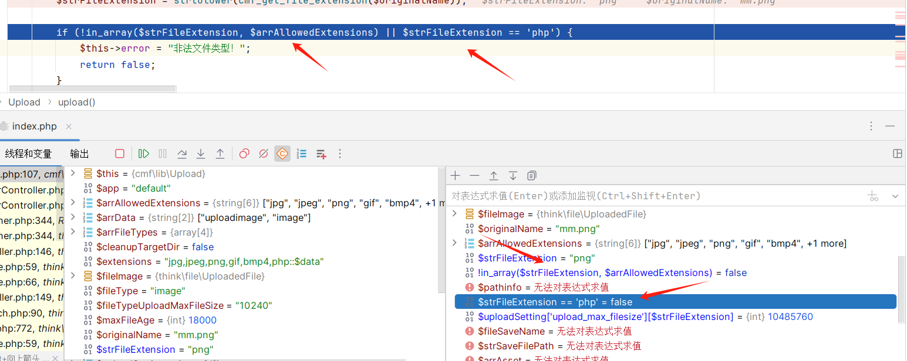

编号 CVE-2024-31615 
#   ThinkCMF 6.0.9 File upload vulnerability

## Source code information

[ThinkCMF: ThinkCMF是一款支持Swoole的开源内容管理框架，基于ThinkPHP开发，同时支持PHP-FPM和Swoole双模式，让WEB开发更快! (gitee.com)](https://gitee.com/thinkcmf/ThinkCMF)


## code analysis
Vulnerability file：ThinkCMF-master/vendor/thinkcmf/cmf-app/src/user/controller/UeditorController.php

Found an editor function point on the site


Find the image upload to capture the corresponding function to find the code file


Enter ueditorUpload("image") according to the code in the upload function and the $action value of the requested package parameter; ,
273 lines of code in the ueditorUpload function process the uploaded file and return the value to $result


The file Upload and the content returned by the return package are completed in the upload class, and the suffix of the uploaded file is mainly detected in lines 103-110


103 lines of code are


105 lines of code are


This if determines whether the suffix is not in the allowed suffix and determines whether the suffix is equal to php, requires that both conditions are not satisfied, and if one of them is met, it directly returns "illegal file type".

```
if (!in_array($strFileExtension, $arrAllowedExtensions) || $strFileExtension == 'php') {  
    $this->error = "非法文件类型！";  
    return false;  
}
```
if you bypass the above if judgment, you can execute the following code to complete the file upload




Add 'php::$dada' to the upload Settings (using windows features to create a' php::$dada' suffix file will eventually create a' php' suffix file) so uploading a' php::$dada' suffix file can bypass the above filtering


Successfully bypass filtering to upload a php file


## Exploits


Change a php file containing shell code to a png suffix to bypass front-end restrictions and upload


Change the png suffix to 'php::$data', send the request packet to complete the upload, and upload successfully


After accessing the url address, use the webshell tool to make a shell connection


